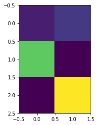
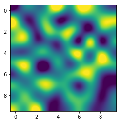
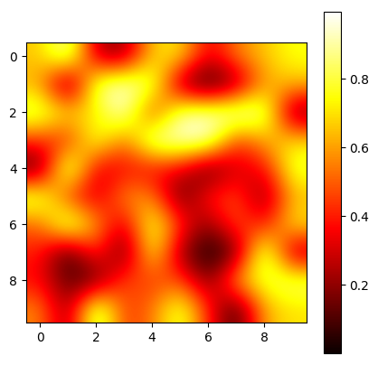
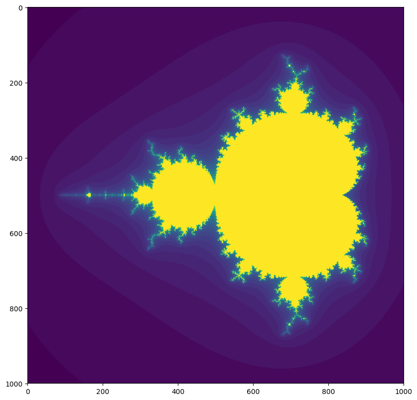
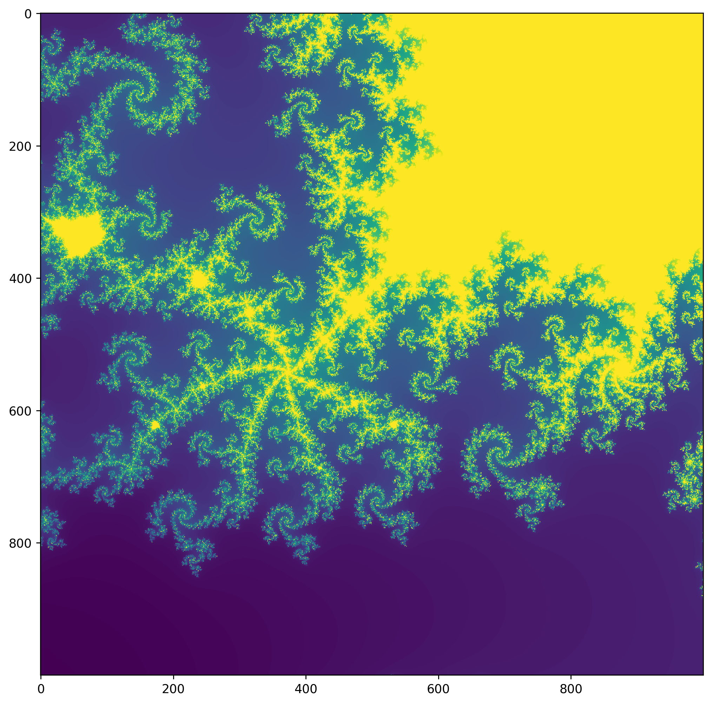

These examples are based off of those from an article in the *Linux Voice* Tutorial, written by Tariq Rashid, entitled *Python: Make Your Own Mandelbrot Set*. This article appeared on pages 96-101
https://www.linuxvoice.com/issues/009/fractal.pdf

# Towards Graphing the Mandelbrot Set

The following are the image exercises that lead up to being able to graph the Mandelbrodt set. Fractals are fascinating mathematical objects. From a computer science perspective, they give a good orientation to using specialized Python modules such as matplotlib and numpy, as well as exploring ideas like recursion. Below we will introduces some techniques around image manipulation.


```python
import matplotlib.pyplot as pyplot     # import pyplot so that we can plot data
import numpy as np                     # import numpy so that we can work with arrays
```


```python
%matplotlib inline
```

We are going to create a 3x2 array of zeros, and then fill-in the array with the values that we desire. We then print the array out. We then plot the array using a color scheme.


```python
dataArray = np.zeros([3,2])
dataArray[0,0] = 1
dataArray[0,1] = 2
dataArray[1,0] = 9
dataArray[2,1] = 12

print(dataArray)

```

    [[  1.   2.]
     [  9.   0.]
     [  0.  12.]]


```python
pyplot.imshow(dataArray, interpolation="nearest")
pyplot.show()
```





Now we will use the random sampling function in the numpy module. This means that everytime one runs the code below it will produce a different picture. The function ```python np.random.rand(10,10)``` returns a 10 x 10 matrix with entries, uniformly distributed, in the interval $[0,1)$. You can learn more about this, at the documentation page, here:
https://docs.scipy.org/doc/numpy-1.13.0/reference/generated/numpy.random.rand.html#numpy.random.rand

In the second example, we have change the interpolation method and the color scheme for the plot; we also have a color bar, along with the plot.


```python
pyplot.imshow(np.random.rand(10,10), interpolation="lanczos")
pyplot.show()
```





```python
fig = pyplot.figure(figsize = (5,5), dpi = 100)
pyplot.imshow(np.random.rand(10,10), interpolation="bicubic", cmap="hot")
pyplot.colorbar()
pyplot.show()
```





An inquiry into the behaviour of functions can take many forms. Introductory calculus courses give one the tools to begin to think about pathological functions. Perhaps a function oscillates so rapidly that it is difficult to control at the origin, or the graph of the function has multiplie components because its domain contains holes. Whatever the case, we come to discover that functions do not always behave as we would expect. Consider the following two examples.


```python
import random
z = random.uniform(0,1)
for _ in range(20):
    z = z**2
    print(z)
```

    0.5441597288081611
    0.2961098104565714
    0.08768101984862665
    0.007687961241695261
    5.910474805380854e-05
    3.4933712425041847e-09
    1.2203642637955231e-17
    1.4892889363491891e-34
    2.217981535932099e-68
    4.919442093735713e-136
    2.4200910513618817e-271
    0.0
    0.0
    0.0
    0.0
    0.0
    0.0
    0.0
    0.0
    0.0


```python
z = random.randrange(1,10)
for _ in range(4):
    z = z**2
    print(z)
```

    16
    256
    65536
    4294967296


In the first case, the number $z$ was chose to be less than one. Squaring the number gave an every decreasing number until it became so close to zero that the computer couldn't tell any different. We say that the sequence converges on zero. The second example does nothing but become big because the number $z$ was chosen to be larger than 1. One says that the second diverges to positive infinitude.

### Complex Numbers
Python can work with complex numbers, with little trouble. A complex number has a real part and an imaginary part. A general complex number is represented as $a+bj$. In mathematics, the $j$ is often represented by an $i$. However, i is already overused in programming language.


```python
# assign the complex number (2+3i) to c
c = complex(2,3)
print(c)

#print c multiplied by 1-4i
print(c * complex(1,-4))

#print c squared
print(c*c)
```

    (2+3j)
    (14-5j)
    (-5+12j)


# The Mandelbrot Set

The recipe, for the Mandelbrodt set, is to square a complex number and add a constant $c$; that is, we want to compute $z^2 + c$. We then study the divergence / convergence of the sequence, when $z^2 + c$ is applied iteratively. The function below computes the sequence $\{z^2+c\}_{n \in \mathbb{N}}$. If the absolute value of z exceeds 4, then the number of iterations is returned. If $\left|z\right|$ never exceeds 4, then the maximum number of iterations passed into the function is returned.


```python
def mandel(c, maxiter):
    z = complex(0,0)
    
    for iter in range(maxiter):
        z = z*z + c
        if abs(z) > 4:
            break
    return iter

div = mandel(complex(.2,-.1), 1000)
con = mandel(complex(.2, -1), 100)
print(div, con)
```

    999 4


```python
# Dividing intervals into evenly spaced points.
x_list = np.linspace(-2.0, 4.0, 13)
y_list = np.linspace(-2.0, 2.0, 9)

for x in x_list:
    for y in y_list:
        print(x,y)
```


```python
xvalues = np.linspace(-2.25, 0.75, 1000)
yvalues = np.linspace(-1.5, 1.5, 1000)

xlen = len(xvalues)
ylen = len(yvalues)

atlas = np.empty([xlen, ylen])
for ix in range(xlen):
    for iy in range(ylen):
        cx = xvalues[ix]
        cy = yvalues[iy]
        c = complex(cx,cy)
        
        atlas[ix,iy]=mandel(c,40)
        
        
fig = pyplot.figure(figsize=(10,10), dpi=100)
pyplot.imshow(atlas.T, interpolation="nearest")
pyplot.show()

```


    <matplotlib.image.AxesImage at 0x10fa404e0>





```python
xvalues = np.linspace(-0.22, -0.21, 1000)
yvalues = np.linspace(-0.7, -0.69, 1000)

xlen = len(xvalues)
ylen = len(yvalues)

atlas = np.empty([xlen, ylen])
for ix in range(xlen):
    for iy in range(ylen):
        cx = xvalues[ix]
        cy = yvalues[iy]
        c = complex(cx,cy)
        
        atlas[ix,iy]=mandel(c, 200)
        
        
fig = pyplot.figure(figsize=(10,10), dpi=250)
pyplot.imshow(atlas.T, interpolation="nearest")
pyplot.show()

```




